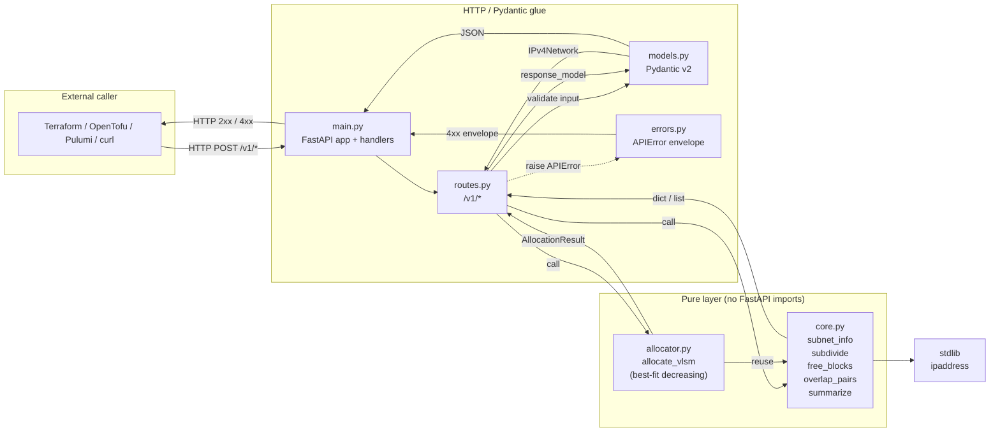

# better-subnet-calculator-api &mdash; BRD

## 1. Context

[better-subnet-calculator](https://github.com/Blackout-Industries/better-subnet-calculator)
is a static, fully client-side IPv4 subnet calculator. It is great for
humans clicking around a tree, but it is not callable from automation.
Infrastructure-as-code pipelines that need to allocate subnets out of a
parent block currently end up either:

- Hand-rolling math with Terraform's `cidrsubnet` / `cidrsubnets`, which
  only handle uniform splits.
- Calling out to an ad-hoc Python script per project.
- Pre-allocating ranges in a wiki and copy-pasting them into modules.

This project adds a small, **stateless** HTTP service that does the
allocation math once, exposes it as JSON, and stays well-defined enough
to be called from Terraform's `http` data source, OpenTofu, Pulumi, or a
plain `curl` in a build pipeline.

It is intentionally a **separate project** from the calculator. The
calculator stays a pure SPA; the API stays a pure compute service. The
only thing they share is the IPv4 math &mdash; and Python's stdlib
`ipaddress` module already does it, so we don't need to port the
TypeScript library over.

## 2. Goals

| # | Goal | Acceptance |
|---|------|------------|
| G1 | Compute subnet metadata for a CIDR.                          | `POST /v1/calculate` returns network, broadcast, netmask, wildcard, host range, host count. |
| G2 | Find unallocated gaps inside a parent given existing children. | `POST /v1/free` returns the maximal free CIDR blocks. |
| G3 | Run a VLSM allocator (best-fit) against a parent block.      | `POST /v1/allocate` accepts a list of named requests with desired prefix lengths and returns assignments. |
| G4 | Split a parent into N equal subnets or to a target prefix.   | `POST /v1/subdivide` returns the children. |
| G5 | Detect overlaps in a list of CIDRs.                          | `POST /v1/overlap` returns overlapping pairs and a deduplicated, summarized list. |
| G6 | Be callable from Terraform without a custom provider.        | Documented `http` data source recipe; output JSON shape stable under `/v1`. |

## 3. Non-goals (v1)

- IPv6. Same call as the frontend &mdash; revisit when there's a real ask.
- Persistent state. The service is request/response only. The caller
  owns the ledger of allocated subnets.
- Authentication. Self-hosted on trusted networks; deploy behind your
  own gateway if you need authn/z. (Health endpoint is the only one
  exposed by default.)
- A custom Terraform provider. Use the built-in `http` data source
  against this API. A provider can come later if it earns its keep.
- Rate limiting / quotas. Out of scope for a stateless internal tool.
- A web UI. The OpenAPI / Swagger UI that FastAPI generates is enough.

## 4. Users and scenarios

**Network engineer** wants to slice a `/16` into mixed-size VPC subnets
(public/private/db) per environment. Calls `POST /v1/allocate` with a
list of `{name, prefix}` and persists the response in their state.

**Platform team** runs a Terraform module that needs the next free
`/24` inside `10.10.0.0/16` given the subnets that already exist in the
remote state. Calls `POST /v1/free`, picks the first result, threads it
into module inputs.

**Auditor / drift check** wants to prove that a hand-maintained list of
allocated blocks does not overlap. Calls `POST /v1/overlap` from a
nightly job; alerts if the response has a non-empty `overlaps` array.

## 5. API design

All endpoints live under `/v1`. Versioning lets us evolve later without
breaking pipelines that already exist.

Common types:

```jsonc
// SubnetInfo
{
  "cidr": "10.0.0.0/24",
  "network": "10.0.0.0",
  "broadcast": "10.0.0.255",
  "netmask": "255.255.255.0",
  "wildcard": "0.0.0.255",
  "prefix": 24,
  "first_host": "10.0.0.1",
  "last_host": "10.0.0.254",
  "total_addresses": 256,
  "usable_hosts": 254,
  "is_private": true
}
```

### 5.1 `POST /v1/calculate`

Single-CIDR info. Useful for sanity checks in CI.

```jsonc
// Request
{ "cidr": "10.0.0.0/24" }

// Response
{ "subnet": SubnetInfo }
```

### 5.2 `POST /v1/subdivide`

Split a parent into N equal children, or down to a target prefix.
Exactly one of `count` and `target_prefix` is required.

```jsonc
// Request
{ "cidr": "10.0.0.0/24", "target_prefix": 26 }
// or
{ "cidr": "10.0.0.0/24", "count": 4 }

// Response
{ "parent": SubnetInfo, "children": [SubnetInfo, ...] }
```

### 5.3 `POST /v1/free`

Given a parent and a list of allocated children, return the maximal
free CIDR blocks that fill the gaps.

```jsonc
// Request
{
  "parent": "10.0.0.0/16",
  "allocated": ["10.0.0.0/24", "10.0.5.0/24"]
}

// Response
{
  "parent": SubnetInfo,
  "allocated": [SubnetInfo, ...],
  "free": [SubnetInfo, ...],     // maximal aligned blocks
  "utilization": 0.0078125        // fraction of parent covered by allocated
}
```

### 5.4 `POST /v1/allocate`

Best-fit-decreasing VLSM allocator. Accepts a list of named requests
with a desired prefix length each. Returns assignments.

```jsonc
// Request
{
  "parent": "10.0.0.0/16",
  "allocated": ["10.0.0.0/24"],
  "requests": [
    { "name": "web",  "prefix": 24 },
    { "name": "app",  "prefix": 25 },
    { "name": "db",   "prefix": 27 }
  ]
}

// Response
{
  "parent": SubnetInfo,
  "assigned": [
    { "name": "web", "subnet": SubnetInfo },
    { "name": "app", "subnet": SubnetInfo },
    { "name": "db",  "subnet": SubnetInfo }
  ],
  "unassigned": [],                 // requests that didn't fit
  "free_after": [SubnetInfo, ...]   // remaining gaps after assignment
}
```

### 5.5 `POST /v1/overlap`

Pairwise overlap detection plus a summarized (non-overlapping) view.

```jsonc
// Request
{ "cidrs": ["10.0.0.0/24", "10.0.0.128/25", "10.1.0.0/16"] }

// Response
{
  "overlaps": [{ "a": "10.0.0.0/24", "b": "10.0.0.128/25" }],
  "summarized": ["10.0.0.0/24", "10.1.0.0/16"]
}
```

### 5.6 Errors

- `400 Bad Request` &mdash; malformed CIDR, prefix out of range, child
  outside parent, conflicting `count` and `target_prefix`.
- `422 Unprocessable Entity` &mdash; FastAPI/Pydantic validation error
  (default).
- `500` is not expected for any input the schema accepts.

Error body:

```jsonc
{ "error": { "code": "INVALID_CIDR", "message": "...", "field": "parent" } }
```

### 5.7 OpenAPI

FastAPI generates `/openapi.json` automatically. Swagger UI lives at
`/docs`, Redoc at `/redoc`. Both are intended as the canonical
documentation &mdash; this BRD only describes intent.

## 6. Tech stack

| Concern              | Choice                                |
|----------------------|----------------------------------------|
| Language             | Python 3.12                            |
| Web framework        | FastAPI (async, auto OpenAPI)          |
| Validation           | Pydantic v2                            |
| ASGI server          | uvicorn (single worker; horizontal scale via container replicas if needed) |
| IP math              | stdlib `ipaddress` (battle-tested)     |
| Package manager      | `uv` for lockfile, virtualenvs in CI   |
| Tests                | pytest, httpx (TestClient), coverage   |
| Lint / format        | ruff                                   |
| Type check           | mypy strict                            |
| Container base       | `python:3.12-slim`, multi-stage        |
| Process supervisor   | none &mdash; uvicorn is PID 1          |
| Versioning           | GitVersion (X.Y.Z derived from git)    |

## 7. Repository layout

```text
better-subnet-calculator-api/
  pyproject.toml
  uv.lock
  README.md
  CONTRIBUTING.md
  SECURITY.md
  LICENSE
  BRD.md
  Dockerfile
  docker-compose.yml
  Makefile
  GitVersion.yml
  .gitignore
  .dockerignore
  .github/
    workflows/docker-publish.yml
    workflows/codeql.yml
    workflows/dependency-review.yml
    workflows/scorecard.yml
    dependabot.yml
    CODEOWNERS
  src/subnet_api/
    __init__.py
    main.py        # FastAPI app, router wiring, lifespan
    routes.py      # /v1/* endpoints
    models.py      # Pydantic request/response schemas
    core.py        # pure functions over ipaddress.IPv4Network
    allocator.py   # best-fit-decreasing VLSM
    errors.py      # API error envelope
  tests/
    conftest.py
    test_core.py
    test_allocator.py
    test_routes.py
```

## 8. Architecture

Layered, with a hard line between **pure functions** (`core.py`,
`allocator.py`) and **HTTP/Pydantic glue** (`models.py`, `routes.py`).
The pure layer never imports FastAPI. This keeps the math testable in
isolation and lets us extract the same logic into a CLI or a Lambda
handler without rewriting it.

- `core.py` works on `ipaddress.IPv4Network` only. Functions:
  `subnet_info`, `subdivide`, `free_blocks`, `overlap_pairs`,
  `summarize`. All return plain dicts/lists; HTTP serialization happens
  at the route layer.
- `allocator.py` exports `allocate_vlsm(parent, allocated, requests)`.
  Best-fit decreasing: sort requests by prefix asc (largest blocks
  first), for each, pick the smallest free block that fits and split
  it down. Stable order on the input is preserved in the response.
- `routes.py` is thin: parse Pydantic input, call core/allocator,
  shape the response model. No business logic here.



The arrows in the pure layer are unidirectional: nothing in `core.py`
or `allocator.py` knows that FastAPI exists. Adding a CLI or a Lambda
handler later means re-using `Pure` against a different `HTTP` layer,
not rewriting either.

## 9. Versioning, releases, supply chain

Mirrors better-subnet-calculator:

- `main` is always releasable. Trunk flow with `feature/*` branches.
- GitVersion auto-bumps patch on each merge to `main`. `+semver: minor`
  or `+semver: major` in the commit message bumps further.
- Container published to `ghcr.io/blackout-industries/better-subnet-calculator-api`
  with tags `X.Y.Z`, `X.Y`, `X`, and `latest`.
- Multi-arch: `linux/amd64`, `linux/arm64`.
- Image signed with cosign keyless OIDC; SBOM and SLSA provenance
  attestation attached to the image.
- Trivy scans the published digest each release; results uploaded to
  the GitHub Security tab.
- CodeQL on every PR (Python + Actions).
- Dependabot for `pip`/`uv`, GitHub Actions, and Docker base image.
- OpenSSF Scorecard runs weekly.

## 10. Verification

End-to-end checks for v1:

1. `make test` passes pytest + coverage.
2. `make build` produces a runnable container.
3. `docker run -p 8000:8000 ghcr.io/.../better-subnet-calculator-api:latest`
   serves `/healthz` 200 and `/docs` 200.
4. The four scenarios from section 4 each have an integration test
   against the live ASGI app via `httpx.AsyncClient`.
5. The "happy path" round-trips through Terraform's `http` data source
   in a sample module under `examples/terraform/`.

## 11. Out-of-scope follow-ups

- IPv6 support (probably v2).
- A small CLI wrapper for Terraform `external` data source so callers
  don't need an HTTP endpoint at all.
- A custom Terraform provider for native typed inputs/outputs.
- A frontend integration in better-subnet-calculator that posts the
  current tree to `/v1/free` and shows free blocks inline.
- Persistent state (a small allocator-as-a-service with a database) if
  there's demand. That is a different product; do not bolt it on here.
